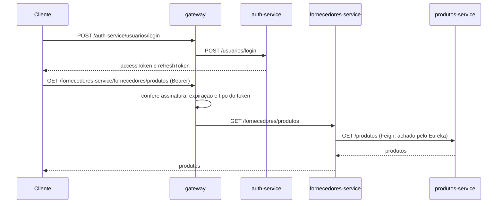

Aluno: Gustavo Cassel - Matrícula (CPF): ###.###.###-## (infnet não tem matrícula e não vou expor meu CPF aqui num repo público 👍)

# API Vendas: microsserviços com Spring Cloud

Projeto da disciplina **Microsserviços e DevOps com Spring Boot e Spring Cloud**. Parte do projeto `api-vendas` construído em sala (branch v10) e acumula duas entregas:

- **TP3:** autenticação com JWT no `auth-service`, com expiração de token, refresh e validação no gateway.
- **AT:** o novo `fornecedores-service`, integrado ao Eureka, ao Config Server, ao Gateway, ao `produtos-service` via OpenFeign, ao Docker Compose e a um pipeline no GitHub Actions.

## Arquitetura

```mermaid
flowchart LR
    cli([Cliente HTTP]) --> gw

    gw["gateway :8085<br/>TokenFilter (JWT)"]
    gw --> auth["auth-service :8086"]
    gw --> forn["fornecedores-service :8084"]
    gw --> prod["produtos-service :8081"]
    gw --> clie["clientes-service :8083"]
    gw --> vend["vendas-service :8082"]

    forn -- OpenFeign --> prod
    vend -- OpenFeign --> prod

    eureka["eureka-server :8761"]
    config["config-server :8888"]
    repo[("config-repo")]

    gw -. descobre os serviços .-> eureka
    config -. lê os .properties .-> repo
```

Todos os serviços de domínio se registram no **Eureka** e buscam a configuração (porta, banco H2, URL do Eureka) no **Config Server**, que lê a pasta `config-repo`. O **Gateway** é a única porta de entrada: descobre os serviços pelo nome registrado no Eureka, sem rotas escritas à mão, e confere o token JWT antes de repassar a requisição.

Cada serviço tem o seu próprio banco H2 em memória.

| Serviço | Porta | Papel |
|---|---|---|
| `eureka-server` | 8761 | Service discovery |
| `config-server` | 8888 | Configuração centralizada (`config-repo`) |
| `produtos-service` | 8081 | Catálogo de produtos |
| `vendas-service` | 8082 | Vendas, consulta produtos via Feign |
| `clientes-service` | 8083 | Clientes |
| `fornecedores-service` | 8084 | Fornecedores, consulta produtos via Feign |
| `gateway` | 8085 | Porta de entrada e validação do JWT |
| `auth-service` | 8086 | Cadastro, login e refresh de token |

## fornecedores-service

Criado a partir do `clientes-service`, com pacote `com.exemplo.fornecedoresservice` e porta **8084** vinda do Config Server. O `application.properties` local tem só o nome da aplicação e o endereço do Config Server; o resto está em `config-repo/fornecedores-service.properties` (e `fornecedores-service-docker.properties` para o perfil docker).

A entidade `Fornecedor` tem `id` gerado pelo banco, `nome` obrigatório e `cnpj` obrigatório e único. Cinco fornecedores são cadastrados automaticamente quando a aplicação sobe (`DataInitializer`).

| Método | Rota | Resposta |
|---|---|---|
| `GET` | `/fornecedores` | Lista todos |
| `GET` | `/fornecedores/{id}` | O fornecedor, ou **404** se o id não existir |
| `POST` | `/fornecedores` | **201** com o fornecedor criado; **409** se o CNPJ já existir; **400** sem nome ou CNPJ |
| `GET` | `/fornecedores/produtos` | Lista de produtos obtida do `produtos-service` via OpenFeign |

Pelo gateway, as mesmas rotas ficam em `http://localhost:8085/fornecedores-service/...`.

## Autenticação

O `auth-service` emite dois tokens no login, assinados com a mesma chave que o gateway usa para conferir:

| | Access token | Refresh token |
|---|---|---|
| Validade | 15 minutos | 7 dias |
| Uso | Header `Authorization: Bearer ...` em toda rota protegida | Só no corpo de `POST /usuarios/refresh` |
| Claim `tipo` | `access` | `refresh` |

Como os dois têm assinatura válida, é a claim `tipo` que impede o refresh token de ser usado como credencial de acesso: o gateway só aceita `tipo=access`, e a rota de refresh só aceita `tipo=refresh`.



Rotas livres (sem token): `POST /auth-service/usuarios`, `POST /auth-service/usuarios/login` e `POST /auth-service/usuarios/refresh`. Todo o resto exige o access token, inclusive as rotas de fornecedores.

## Como executar

Pré-requisito: Docker em execução.

```bash
docker compose up -d --build
docker compose ps
```

Um único comando sobe os oito containers. O compose só inicia os serviços de domínio depois que o `config-server` e o `eureka-server` ficam `healthy`, então ninguém sobe sem configuração. Em cerca de um minuto todos aparecem em <http://localhost:8761>.

Para rodar sem Docker, cada serviço é um projeto Maven independente. Suba primeiro `eureka-server` e `config-server`, depois os demais:

```bash
cd fornecedores-service
mvn spring-boot:run
```

## Exemplos de requisição

```bash
# cadastro e login
curl -X POST http://localhost:8085/auth-service/usuarios -H "Content-Type: application/json" -d '{"nome":"Gustavo Cassel","email":"gustavo@teste.com","senha":"senha-forte"}'
curl -X POST http://localhost:8085/auth-service/usuarios/login -H "Content-Type: application/json" -d '{"email":"gustavo@teste.com","senha":"senha-forte"}'

# fornecedores pelo gateway (use o accessToken do login)
curl http://localhost:8085/fornecedores-service/fornecedores -H "Authorization: Bearer ACCESS_TOKEN"
curl http://localhost:8085/fornecedores-service/fornecedores/99 -H "Authorization: Bearer ACCESS_TOKEN"
curl http://localhost:8085/fornecedores-service/fornecedores/produtos -H "Authorization: Bearer ACCESS_TOKEN"
curl -X POST http://localhost:8085/fornecedores-service/fornecedores -H "Authorization: Bearer ACCESS_TOKEN" -H "Content-Type: application/json" -d '{"nome":"Metalurgica Leste Ltda","cnpj":"66.777.888/0001-12"}'

# renovar o token
curl -X POST http://localhost:8085/auth-service/usuarios/refresh -H "Content-Type: application/json" -d '{"refreshToken":"REFRESH_TOKEN"}'
```

Configuração servida pelo Config Server: <http://localhost:8888/fornecedores-service/default>. Console do H2 do fornecedores-service: <http://localhost:8084/h2-console> (JDBC URL `jdbc:h2:mem:fornecedoresdb`, usuário `sa`, sem senha).

## Pipeline (GitHub Actions)

O workflow `.github/workflows/fornecedores-service.yml` roda a cada push, em qualquer branch: baixa o código, instala o Java 17 (Temurin, com cache do Maven) e compila o `fornecedores-service` com `mvn -B package`.

## Testes

```bash
cd auth-service
mvn test
```

São 14 testes no `auth-service`: `JwtServiceTest` cobre conteúdo e expiração dos tokens, recusa de token expirado, de assinatura falsa e de access token usado no lugar do refresh; `UsuarioControllerTest` cobre os status HTTP de cadastro, login e refresh.

## Decisões

- **Porta do auth-service:** o enunciado do AT reserva a 8084 para o `fornecedores-service`, mas na branch v9/v10 ela já era do `auth-service`. Mudei o `auth-service` para a 8086 (Config Server, Dockerfile, compose e manifests do Kubernetes) para os dois conviverem.
- **Fornecedores atrás do JWT:** como o projeto já tem a autenticação do TP3, o gateway exige token também nas rotas de fornecedores. Acesso direto pela porta 8084 continua possível para desenvolvimento.
- **POST sem erro 500:** CNPJ repetido devolve 409 e campos obrigatórios vazios devolvem 400, no mesmo padrão do cadastro de usuários. O `id` enviado no corpo é ignorado, então um POST nunca sobrescreve um fornecedor existente.
- **Healthchecks no compose:** antes, os serviços podiam subir antes do Config Server responder e acabavam na porta 8080, apontando o Eureka para `localhost`. Agora o compose espera o Config Server e o Eureka ficarem saudáveis.
